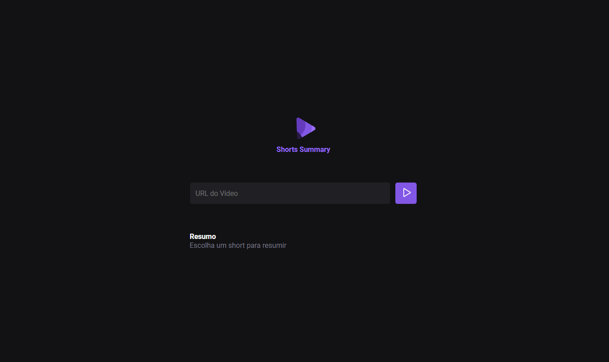

# NLW IA

> Projeto NLW

Projeto feito através da semana NLW da Rocketseat onde é desenvolvido um projeto com Inteligência Artificial que faz download de um vídeo tipo Shorts do youtube, transcreve e faz um resumo dele.

## 🚀 Tecnologias

- Javascript
- Axios
- NodeJS
- Cors
- Express
- FFMPeg
- YTDL-core
- Node-wav
- Xenova
- Git e Github

## 📞 Contato

> rafael.loren175@gmail.com

> +55 (11) 99959-9140

## 👾 Discord

> rafas#7622
